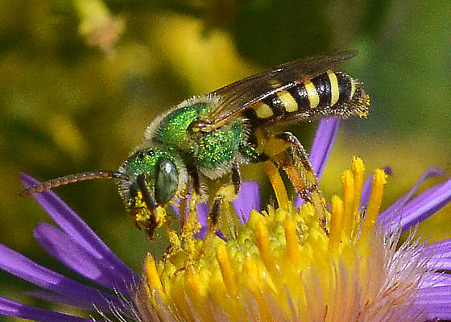

<!-- Lesson Overview -->

# Conservation/ecology Topics 

> - Species distributions 

# Computational Topics
> -  Convert a data frame to a spatial object.
> -  Plot multiple spatial layers.

-------------------------------
```{r load-libraries, echo=FALSE, results="hide", message=FALSE, warning=FALSE}
library(terra)
library(ggplot2)
library(dplyr)
library(sf)
```

# Lab part 1: Oregon bee atlas data exploration 

a. Import the OBA data.
```{r}

OBA_data <- read.csv("OBA_2018-2023.csv")
OBA_data

OBA_data <- OBA_data %>% select(Genus, Species, Dec..Lat., Dec..Long., Associated.plant, MonthJul)
OBA_data
```

b. Find the columns related to genus and species and paste them together (with a space between) using the function paste(). Name the new column GenusSpecies.
```{r}

OBA_data$GenusSpecies <- paste(OBA_data$Genus, OBA_data$Species)

?paste()
```

c. Use `sort()` and `unique()` to print the unique values of GenusSpecies in alphabetical order.  How many species are there? 

```{r}
unique_genus_species <- sort(unique(OBA_data$GenusSpecies))
summary(unique_genus_species)

#There are 539 species

```

Some specimens are not identified to species, only genus. How is this reflected in the data? 
In two weeks we will learn how to clean this up using regular expressions. 
ANSWER: This is reflected in the data by the Genus Species column just having the genus name with a space after it. 

d. So many bees, so little time. Count up the occurrences of each bee species, and subset the data to bees that have been seen at least two times. 
You can use the tidyverse or any other functions in R that you like. How many "species" are there? 

```{r}
# count up the occurrences of each species
bee_count <- OBA_data %>% 
  
  #omit rows without species
  filter(!is.na(Species) & Species != "") %>%
  
  #count up each species
  count(GenusSpecies) %>%
  
  #subset to bees that have been seen at least 2 times
  filter(n >= 2)
bee_count

#number of species 
num_species <- nrow(bee_count)
num_species

#404 species have been seen at least 2 times

```

e. Google a few bee names (that have been seen > 2 times) and find one with an a look that resonates with you.

What is the name of your bee? 
ANSWER: Agapostemon virescens

Import the photos into Rmarkdown below (hint: googling bee name "discover life" or "inat" can often get you a photo. Many bees will no have any photos :( 

{alt='Extent illustration'} Image Source: BugGuide.Net


# Lab part 2: Plotting the distrubution of your spirit bee. 

How that have chosen your spirit bee, we would like to plot it's distribution. What is the crs of the data? Annoyingly it is not described anywhere in the spreadsheet (always list your crs in your data) but it is the same as what inat uses because all bees have a georeferenced plant host. If the data is in lat long, it is "unprojected" so only a datum will be listed. 
DATUM: WGS84, unprojected lat long. EPSG code: 4326. 


```{r}
crs("EPSG:4326")
```

a. Extract the X and Y locations for your species only from the data and create a spatial object. Don't forget to set the CRS! 
Hint 1: consider what other data you would like to keep as attributes, for example what flower they were foraging on. Hint 2: Remember the lat is y and long is x. 
Hint 3: You may want to rename the column names you can use, colnames() and reassign the names, since the ones in the oba data spreadsheet are really ugly. 

```{r}
#select columns
OBA_data_xy <- OBA_data %>% 
  select(Dec..Lat., Dec..Long., MonthJul, GenusSpecies) %>%
  
#filter to species of choice
  filter(GenusSpecies == "Agapostemon virescens")


#rename columns
colnames(OBA_data_xy)[colnames(OBA_data_xy) == "Dec..Lat."] <- "Latitude"
colnames(OBA_data_xy)[colnames(OBA_data_xy) == "Dec..Long."] <- "Longitude"
colnames(OBA_data_xy)[colnames(OBA_data_xy) == "MonthJul"] <- "MonthCollected"

#remove rows with missing Longitude or Latitude values
OBA_data_xy <- OBA_data_xy %>%
  filter(!is.na(Longitude) & !is.na(Latitude))

#create sf object
EPSG4326 <- crs("EPSG:4326")


OBA_data_xy <- st_as_sf(OBA_data_xy,
                                   coords = c("Longitude", "Latitude"),
                                   crs = EPSG4326)

```

b. Plot your exciting bee data!

```{r plot-data-points}
ggplot() +
  geom_sf(data = OBA_data_xy, color = "black") +
  ggtitle("Map of Agapostemon virescens locations")

```

Not so exciting without some kind of background... 

Luckily we can download basemaps into R using the map_data function in ggplot (among many others). There is an example for retrieving the Oregon county polygons. 

```{r plot-or}
or <- map_data("county", "oregon") %>% 
  select(lon = long, lat, group, id = subregion)

```

c. Add your species's points to your choice or an Oregon basemap. 

```{r plot-data-points-basemap}
library(ggspatial)


ggplot() +
  
  #counties
  geom_polygon(data = or, aes(x = lon, y = lat, group = group), 
               fill = "lightgray", color = "black") +

  #bee points
  geom_sf(data = OBA_data_xy, color = "hotpink", size = 1) +
  ggtitle("Map of Agapostemon virescens locations with counties") +
  theme_minimal() 
  


```
# Lab part 3: Cartography

a. Here is your moment to explore your cartographic skills. 
1. Add another spatial layer relevant to your final project and tweek the Oregon map in anyway that is useful/visually appealing. You may need to crop that layer to the extent of your species's distribution. 
2. Color your points according to some data attribute and add a legend (month collected, county, collector, associated plant, whatever you think is interesting). You may need to circle back to 2.1 to save
additional attributes when you converted the dataframe to a spatial object. 
3. Fine-tune your map: add a title, make sure the legend label makes sense, add a scale bar (google "add scale bar map ggplot" and choose your favorite package). All maps must always have a scale bar. You can add a N arrow as well, though some cartographers argue that is only necessary if N isn't at the top of the map.
4. Write a figure caption for your map explaining any interesting trends you see. 
5. Export you cropped layer to a .shp so you can use it again for your final project.
6. Push this lab to your github repo (just the .Rmd, don't push the data!)

```{r plot-creative}
# prep the data

#load in ecoregions data
ecoregions_shp <- st_read("OR-ecoregions/Ecoregions_OregonConservationStrategy.shp")

#make them have same crs
ecoregions_shp <- st_transform(ecoregions_shp, crs = 4326)

# This should return TRUE
crs(ecoregions_shp) == crs(OBA_data_xy)


```

```{r}
# prep the layers for mapping, change colors and order

#color pallets for ecoregions and months
ecoregion_colors <- c("Klamath Mountains" = "#f7fbff",
                      "Northern Basin and Range" = "#deebf7",  
                      "West Cascades" = "#c6dbef",  
                      "East Cascades" = "#9ecae1", 
                      "Blue Mountains" = "#6baed6", 
                      "Columbia Plateau" = "#4292c6",  
                      "Willamette Valley" = "#2171b5",  
                      "Coast Range" = "#08519c",  
                      "Nearshore" = "#08306b")  


month_colors <- c("January" = "red", 
                  "February" = "red", 
                  "March" = "#f7f4f9",  
                  "April" = "#e7e1ef", 
                  "May" = "#d4b9da",  
                  "June" = "#c994c7",  
                  "July" = "#df65b0",  
                  "August" = "#e7298a",  
                  "September" = "#ce1256",  
                  "October" = "#980043",  
                  "November" = "#67001f",  
                  "December" = "red")

#putting months in order so the legend is in order
OBA_data_xy$MonthCollected <- factor(OBA_data_xy$MonthCollected,
                                      levels = c("January", "February", "March", "April", "May", "June", "July", "August", "September", "October", "November", "December"))


# packages to add a scale bar 
# install.packages(ggspatial)
library(ggspatial)
```

```{r}
#make map
ggplot() +
  
  #ecoregion shapefile
  geom_sf(data = ecoregions_shp, aes(fill = Ecoregion)) +
  
   scale_fill_manual(values = ecoregion_colors) + 
  
  #counties
  geom_polygon(data = or, aes(x = lon, y = lat, group = group), 
               fill = NA, color = "black") +

  #bee point data
  geom_sf(data = OBA_data_xy, aes(color = MonthCollected) , size = 1) +
   scale_color_manual(values = month_colors, na.value = "grey") +
  
  #title and such
  
  #title
  ggtitle("Map of Agapostemon virescens locations \n with Oregon Counties and Ecoregions") +
  
  
  #scalebar 
   annotation_scale(location = "br", width_hint = 0.2) +

   #north arrow
    annotation_north_arrow(location = "tl", which_north = "true", 
                         style = north_arrow_nautical()) +
   
#make legend adjustments
  theme( 

  #resize legend
legend.key.size = unit(0.4, "cm"),
    legend.text = element_text(size = 6.5)) +

     # rename legend
labs(color = "Month Collected") +
  labs(x = "Longitude",
      y = "Latitude",
      caption = "This map is looking at the distribution of the Agapostemon virescens bee \n species within Oregon state. This map shows that this species is very common \n in the Willamette Valley ecoregion, but it is more sparse throughout the rest of \n the state. It is not seen throughout the central parts of the state, or in the \n southern and eastern areas. It is also apparent that Agapostemon virescens is \n commonly collected in the months May-September, telling us \n that either the bee or the collectors are most active at this time")


```


We are looking forward to seeing the maps you create! 

# Lab part 4: Spatial summary statistics
 For your final projects, you will likely need to come up with summary statistics that describes the areas around where bees are captured. 
a. Using the distribution of your chosen bee and the spatial layer you imported in 2.6, extract a meaningful summary statistics from your spatial layer within a buffer of 500, 750 1000 km.
b. Create a plot that illustrates this summary data (box plot, barplot, scatter plot, historgram). 
c. Create a map of your cropped spatial data.

```{r buffers}
# a.

# perform a spatial join to count how many points fall in each ecoregion
joined_data <- st_join(OBA_data_xy, ecoregions_shp)

# count the points per ecoregion
point_counts <- table(joined_data$Ecoregion) 
print(point_counts)


# add point counts as a new column to ecoregions
ecoregions_shp$point_count <- as.integer(point_counts[match(ecoregions_shp$Ecoregion, names(point_counts))])
```

```{r}
# convert the counts into a data frame for plotting
count_df <- as.data.frame(point_counts)
colnames(count_df) <- c("Ecoregion", "Count")

# bar plot
ggplot(count_df, aes(x = reorder(Ecoregion, -Count), y = Count)) +
  geom_bar(stat = "identity", fill = "skyblue") +
  labs(x = "Ecoregion", y = "Number of Points", title = "Points per Ecoregion") +
  theme(axis.text.x = element_text(angle = 45, hjust = 1))

```


```{r}
# c. 
ggplot(data = ecoregions_shp) +
  geom_sf(aes(fill = point_count)) +
  scale_fill_viridis_c(name = "Number of Points") +
  labs(title = "Agapostemon virescens Points per Ecoregion") +
  theme_minimal() +
  theme(legend.position = "bottom")
```


